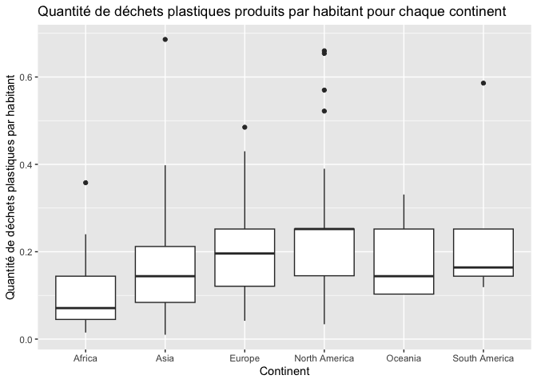

Lab 02 - Plastic waste
================
Laeticia Tremblay
17 septembre 2025

## Chargement des packages et des données

``` r
library(tidyverse) 
```

``` r
plastic_waste <- read_csv("data/plastic-waste.csv")
```

Commençons par filtrer les données pour retirer le point représenté par
Trinité et Tobago (TTO) qui est un outlier.

``` r
plastic_waste <- plastic_waste %>%
  filter(plastic_waste_per_cap < 3.5)
```

## Exercices

### Exercise 1

``` r
ggplot(data = plastic_waste, 
       aes (x = plastic_waste_per_cap)) +
  geom_histogram(binwidth = 0.2) +
    facet_wrap(~ continent)
```

<!-- -->

Certains continents ont une quantité de déchets produits par jour par
habitant plus élevée que d’autre. En effet, l’Afrique est un très petit
producteur de déchets plastiques. La production de déchets plastiques
par habitant se ressemble en Amérique du Sud, en Europe et en Océanie,
où la majorité des habitants en produisent environ 0,25 kg par jour et
où très peu en produisent plus que ça. Finalement, l’Asie et l’Amérique
du Nord sont les plus gros producteurs de déchets plastiques. Une
majorité en produit 0,25 kg par jour et plusieurs en prodsuisent plus.

### Exercise 2

``` r
ggplot(data = plastic_waste, 
       aes (x = plastic_waste_per_cap)) +
  geom_density(adjust = 1) 
```

<!-- -->

``` r
ggplot(data = plastic_waste, 
       aes (x = plastic_waste_per_cap, color = continent)) +
  geom_density(adjust = 1) 
```

<!-- -->

``` r
ggplot(data = plastic_waste, 
       aes (x = plastic_waste_per_cap, color = continent, fill = continent)) +
  geom_density(adjust = 1) 
```

<!-- -->

``` r
ggplot(data = plastic_waste, 
       aes (x = plastic_waste_per_cap, color = continent, fill = continent)) +
  geom_density(adjust = 1, alpha = 0.4) 
```

<!-- -->

C’est parce que lorsqu’on écrit dans la section aes, le réglage dépend
de la donnée et donc change avec elle. Par exemble, la couleur change
pour chaque continent. Quand on écrit dans la section geom_density, le
paramètre reste le même pour chaque donnée. Ainsi, la transparence est
identique pour chaque continent.

### Exercise 3

Boxplot:

``` r
ggplot(data = plastic_waste, 
       aes (x = continent, y = plastic_waste_per_cap)) +
  geom_boxplot() 
```

<!-- -->

Violin plot:

``` r
ggplot(data = plastic_waste, 
       aes (x = continent, y = plastic_waste_per_cap)) +
  geom_violin() 
```

<!-- -->

Les violins plots permettent de mieux voir la densité/la répartition des
différentes valeurs, ce que les boxs plots ne peuvent pas faire. En
effet, les boxs plots montrent plutôt des statistiques sur la
distribution.

### Exercise 4

``` r
ggplot(data = plastic_waste, 
       aes (x = plastic_waste_per_cap, y = mismanaged_plastic_waste_per_cap, color = continent)) +
  geom_point() 
```

<!-- -->

Il y a une relation linéaire entre la quantité de déchet et la quantité
de déchets non gerés. En effet, plus les gens produisent des déchets,
plus il y a de déchets non gerés. En colorant les points selon le
continent, on peut voir que l’Europe et l’Amérique du Nord ont plus de
déchets, mais que ceux si sont mieux gerés (surtout en Europe), car la
quantité de déchets non gerés augmente moins. On peut aussi voir que des
continents comme l’Afrique, l’Asie et l’Océanie produisent moins de
déchets plastiques, mais que ceux-ci sont moins bien gerés, car la
quantité de déchets plastiques non gerés augmente plus.

### Exercise 5

``` r
ggplot(data = plastic_waste, 
       aes (x = total_pop, y = plastic_waste_per_cap)) +
  geom_point() 
```

    ## Warning: Removed 10 rows containing missing values or values outside the scale range
    ## (`geom_point()`).

<!-- -->

``` r
ggplot(data = plastic_waste, 
       aes (x = coastal_pop, y = plastic_waste_per_cap)) +
  geom_point() 
```

<!-- -->

En regardant les deux graphiques, il ne semble pas vraiment y avoir une
relation plus forte pour une des deux paires de variables. Les deux
graphiques sont très similaires.

## Conclusion

Recréez la visualisation:

``` r
# insert code here
```
